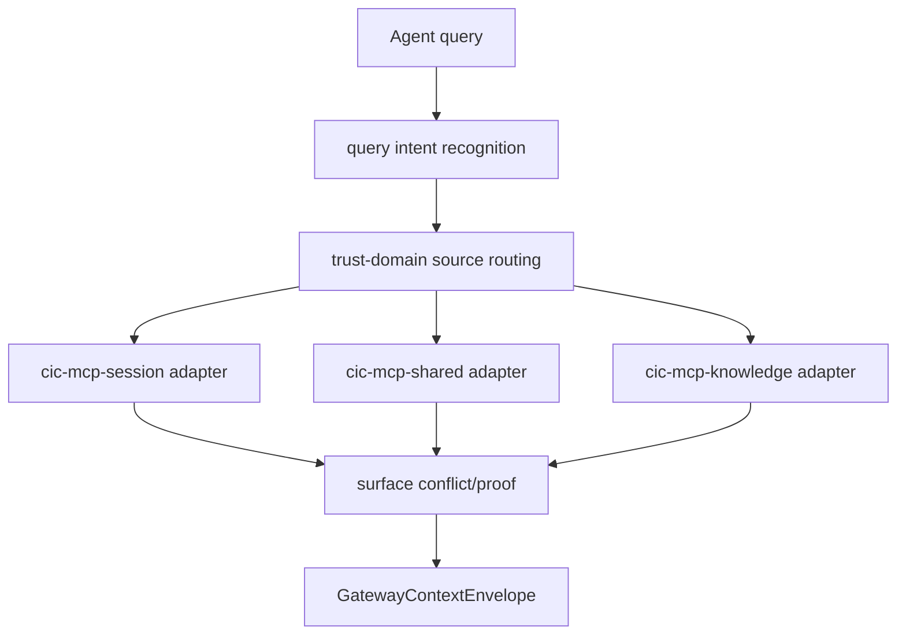

# System Architecture Overview

This document provides a high-level overview of the `cic-mcp-gateway` component's architecture
and its role within the `cic-mcp-*` family. The goal is for a new developer/agent to understand
the component's fundamental concepts and boundaries within 5-10 minutes.

The full, normative design source lives in the `cic-mcp-factory` repo:
[`.cic-context/factory-docs/architecture.md`](https://github.com/CentralInfraCore/cic-mcp-factory/blob/main/.cic-context/factory-docs/architecture.md#cic-mcp-gateway) —
this document is the gateway-specific excerpt of it.

## The "Gateway layer" concept

In the trust-domain layering of the `cic-mcp-*` family, this component **stores nothing** —
it translates the session/workdir/knowledge/shared sources into a single, trust-marked
context package (`GatewayContextEnvelope`).

```text
cic-mcp-knowledge   reviewed/canonical knowledge, versioned
cic-mcp-workdir     current repo/worktree/branch/diff (role filled by cic-factory)
cic-mcp-session     session-scope event, timeline, chunk, retrieval, provenance
cic-mcp-shared      cross-session memory, weighting, conflict
cic-mcp-gateway     trust-domain aware context compiler                        ← THIS REPO
cic-mcp-factory     the family's capability production/maintenance factory
```

## Boundaries

**Yes:**
- query intent recognition
- trust-domain source routing
- source registry usage
- surfacing conflicts/proof
- assembling `GatewayContextEnvelope`
- agent-facing context API

**No:**
- raw event store
- embedding store
- factory runner
- canonical promotion

Forbidden shortcuts: `gateway != proxy`, `gateway != vector store`, `route_query != search_all`.

## Trust model

```yaml
gateway_role: trust_domain_context_compiler
owns_raw_storage: false
owns_embedding_store: false
returns_trust_envelope: true
```

The gateway does not create truth — it compiles context from the source layers, always
preserving/marking trust level.

## Planned data flow (not yet implemented)



Fields: `answer_type`, `query_intent`, `scope`, `sources_used`, `trust_summary`,
`canonical_facts`, `workdir_facts`, `session_derived_notes`, `shared_memory_notes`,
`conflicts`, `proof_requirements`, `refs`. Capability job order:
`gateway-context-envelope-contract-001` → `gateway-session-adapter-contract-001`.

## Current state

The repo was bootstrapped from the `base-repo` `mcp/main` MCP server scaffold (2026-06-20) —
this closes the bootstrap branch of the `gateway-repo-baseline-or-bootstrap-001` job. None of
the above data flow is implemented yet, `source/` is empty.
