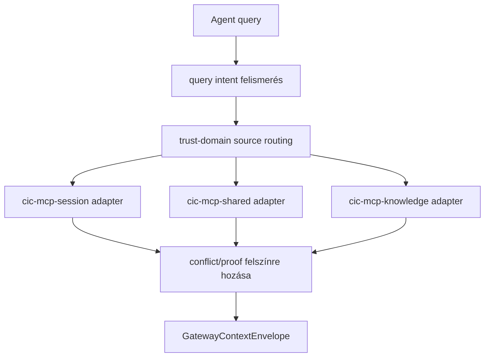

# Rendszer Architektúra Áttekintés

Ez a dokumentum a `cic-mcp-gateway` komponens magas szintű architektúráját és a `cic-mcp-*`
családban betöltött szerepét mutatja be. A cél, hogy egy új fejlesztő/agent 5-10 perc alatt
megértse a komponens alapvető koncepcióit és határait.

A teljes, normatív tervezési alap a `cic-mcp-factory` repóban él:
[`.cic-context/factory-docs/architecture.md`](https://github.com/CentralInfraCore/cic-mcp-factory/blob/main/.cic-context/factory-docs/architecture.md#cic-mcp-gateway) —
ez a dokumentum annak a gateway-specifikus kivonata.

## A "Gateway réteg" koncepció

A `cic-mcp-*` család trust-domain rétegezésében ez a komponens **nem tárol semmit** — a
session/workdir/knowledge/shared forrásokat fordítja egységes, trust-jelölt kontextus-csomaggá
(`GatewayContextEnvelope`).

```text
cic-mcp-knowledge   reviewed/canonical tudás, verziózott
cic-mcp-workdir     aktuális repo/worktree/branch/diff (= cic-factory szerepe)
cic-mcp-session     session-scope event, timeline, chunk, retrieval, provenance
cic-mcp-shared      cross-session memória, súlyozás, konfliktus
cic-mcp-gateway     trust-domain aware context compiler                        ← EZ A REPO
cic-mcp-factory     a család capability gyártó/karbantartó factory-ja
```

## Fő határok

**Igen:**
- query intent felismerés
- trust-domain source routing
- source registry használat
- conflict/proof felszínre hozása
- `GatewayContextEnvelope` összeállítása
- agent-facing context API

**Nem:**
- raw event store
- embedding store
- factory runner
- canonical promotion

Tiltott rövidítések: `gateway != proxy`, `gateway != vector store`, `route_query != search_all`.

## Trust modell

```yaml
gateway_role: trust_domain_context_compiler
owns_raw_storage: false
owns_embedding_store: false
returns_trust_envelope: true
```

A gateway nem hoz létre igazságot (`does not create truth`) — a forrásrétegekből compileál
kontextust, a trust-szintet mindig megőrzi/jelöli.

## Tervezett adatfolyam (még nem implementált)



Mezők: `answer_type`, `query_intent`, `scope`, `sources_used`, `trust_summary`,
`canonical_facts`, `workdir_facts`, `session_derived_notes`, `shared_memory_notes`,
`conflicts`, `proof_requirements`, `refs`. A capability-jobok sorrendje:
`gateway-context-envelope-contract-001` → `gateway-session-adapter-contract-001`.

## Jelenlegi állapot

A repo a `base-repo` `mcp/main` MCP-szerver scaffold-jából lett bootstrapelve
(2026-06-20) — a `gateway-repo-baseline-or-bootstrap-001` job bootstrap-ága ezzel lezárva.
A fenti adatfolyamból jelenleg semmi nincs implementálva, a `source/` mappa üres.
